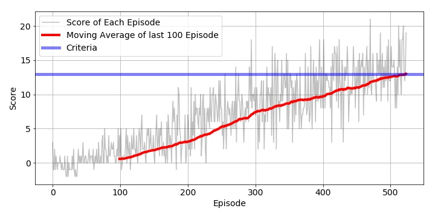

# Summary
In this report, I describe training result using **DQN**.
The naive RL algorithm(Q-learning) is about creating the cheat sheet Q for action and reward, however , if the combinations of states and actions are too large, the memory and the computation requirement for Q will be too high, DQN is addressing that problem, instead of remember solutions, DQN generalize the approximation of Q-Value function by NN, in naive Q-learning, the experience tuples are sequential correlated, so different with supervised learning, the input and target change constantly during the process, to solve these problem, DQN are using: 
## replay buffer
to collect the experience tuples while interacting with the enviroment
## Experience replay
to sampling a small batch of tuples from the replay buffer in order to learn more individual tuples multiple times, recall rare occurrences and in general make better use of our experiences
## Fixed Q-targets
use two deep network, the first one to retrieve Q values(target network) while the second one includes all updates in the training(local network), network target synchronize slightly(soft-update) with local network to fix the Q-value targets temporarily so we don't have a moving target to chase.
##E psilon Greedy
Agent select next action based on Epsilon Greedy. At probability epsilon, agent select at random from action space. The value of epsilon is set 0.999, and decrease gradually with time until 0.001.
## Loss function
Calculate the Q-target in target network by states from batch of expierence tuples;
Calculate the expected Q values from local network
Calculate loss between q-target and Q-values then update optimizer

## Hyperparameters
BUFFER_SIZE = int(1e5)  # replay buffer size
BATCH_SIZE = 64         # minibatch size
GAMMA = 0.99            # discount factor
TAU = 1e-3              # for soft update of target parameters
LR = 5e-4               # learning rate 
UPDATE_EVERY = 4        # how often to update the network

# Learning Algorithm
Source code of learning algorithm is placed in `model.py' and 'agent.py'.

## 1. model.py
this is the deep learning model, I used two layer neural network as Q-Value Estimator.
Hidden layers are composed of ``State -> 64 -> ReLU -> 64 -> ReLU -> Action``

## 2. agent.py
agent.py is the reinforment learning agent to provide action for state

# parameters after training
the parameters from training saved in ./checkpoint.pth

# Rewards Plot
This is plot of rewards when training.

